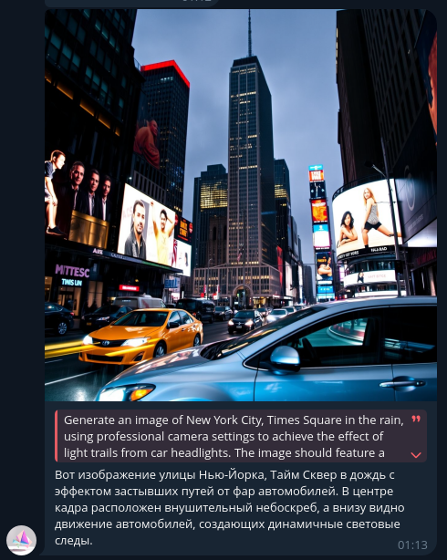
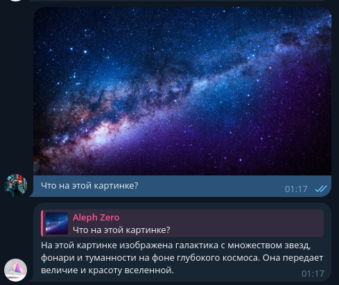
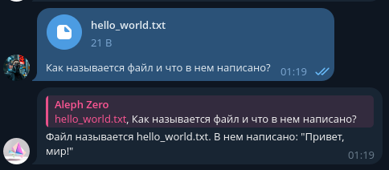
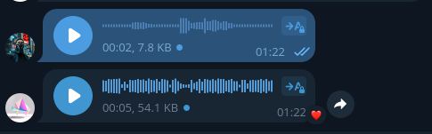
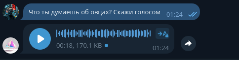

# Проект LLM AIO

Телеграм бот, который позволяет через G4F удобно использовать различные LLM и также генерацию изображений

## Фичи проекта:

1. Генерация изображений
2. Распознавание изображений
3. Чтение текстовых файлов
4. Понимание голосовых сообщений
5. Генерация голосовых сообщений
6. Множественный выбор голосов для TTS
7. Множественный выбор моделей для генерации текстов и изображений
8. База данных пользователей и чатов

#### Генерация изображений

Можно генерировать изображения прямо в боте, без каких-либо доп. команд, а просто вводя запрос "Сгенерируй такое изображение ..."



#### Распознавание изображений

Множество моделей могут распознавать информацию с картинок:



#### Чтение текстовых файлов

Каждая модель может читать приложенный текстовый файл:



#### Понимание голосовых сообщений

Каждая модель может понимать голосовые сообщения (через Google API). Она отвечает на голосовыми сообщениями своими, с ответами на вопросы в вашем сообщении 



#### Генерация голосовых сообщений

Каждая модель может генерировать голосовые сообщения, даже когда на вход не голосовое сообщение



#### Множественный выбор голосов для TTS

Бот имеет в себе несколько голосов для TTS:
`alloy`, `echo`, `fable`, `onyx`, `nova`, `shimmer`, `coral`, `verse`, `ballad`, `ash`, `sage`, `amuch`, `dan`

Выбирайте любой понравившийся! В боте также можно динамически менять их.

#### Множественный выбор моделей для генерации текстов и изображений

Бот имеет огромное количество моделей для генерации текста. Все их можно посмотреть в исходниках [g4f](https://github.com/xtekky/gpt4free/blob/main/g4f/models.py)

#### База данных пользователей и чатов

Бот хранит всю информацию в `sqlite3` базе данных. Там сохраняются: 

- сообщения отдельных пользователей и ответов бота
- выбранная модель для текста и изображений
- выбранный голос для TTS

## Запуск проекта

Установите зависимости из `requirements.txt`:

```shell
pip install requirements.txt
```

Создайте папку `databases` в корневой папке проекта.

Создайте структуру `runtime` папок:
```
runtime
|------- images/*
|------- userdata/*
```

В папке `configs` создайте папку `dev`, там создайте файл `bot_cfg.json` с таким содержимым:

```
{
    "API_KEY": "12345:ABCDEF12345"
}
```

На место значения для `API_KEY` вставьте ключ, полученный от `@BotFather`

Наконец, запустите главный файл:

```shell
python ./tg_main.py
```